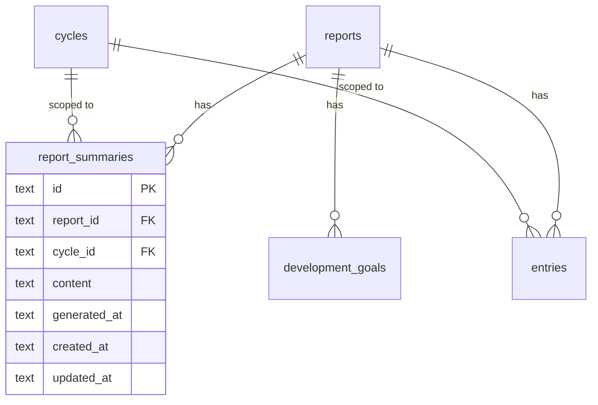

# AI Text Improvement & Report Summary

## Overview

Add two AI-powered features to the Team Performance Diary:

1. **AI Text Improvement** -- Every text input (MarkdownEditor + plain textareas) gets a sparkle button that sends text to an N8N webhook, returns improved text, and shows an inline word-level diff with Accept/Reject controls.
2. **AI Report Summary** -- Each report detail page gets a collapsible summary section (above Development Goals) that generates a markdown recap of all entries and goals for the active cycle via an N8N webhook, stored per report+cycle in the database.

Both features use N8N webhooks as the AI backend, keeping the app decoupled from any specific LLM provider.

## Problem Statement / Motivation

Team leads writing performance feedback, career conversation notes, and development goals often produce text that could benefit from grammar and clarity improvements. Currently there's no way to polish text without leaving the app. Additionally, there's no way to get a quick overview of how a team member is performing across all their entries in a cycle -- you have to read each entry individually.

## Proposed Solution

### Architecture

```
┌──────────────────────┐       ┌──────────────────────┐
│   Next.js Frontend   │       │    N8N Webhooks       │
│                      │       │                       │
│  [Improve ✨] button ──POST──▶ /improve-text         │
│                      │◀─────── { improved_text }     │
│                      │       │                       │
│  [Generate Summary]  ──POST──▶ /report-summary       │
│                      │◀─────── { summary }           │
└──────────┬───────────┘       └───────────────────────┘
           │
     ┌─────▼─────┐
     │  libSQL /  │
     │   Turso    │
     │            │
     │ report_    │
     │ summaries  │
     └────────────┘
```

The Next.js API routes act as a proxy to N8N, keeping webhook URLs and auth tokens server-side only. The frontend never calls N8N directly.

### N8N Webhook Contracts

**Text Improvement:**
```
POST {N8N_IMPROVE_TEXT_WEBHOOK_URL}
Headers: Authorization: Bearer {N8N_WEBHOOK_AUTH_TOKEN} (if configured)

Request:  { "text": string, "context": string }
Response: { "improved_text": string }
```
- `text`: The raw text to improve
- `context`: Optional hint about the field (e.g., "feedback situation", "development goal", "kudos description")

**Report Summary:**
```
POST {N8N_REPORT_SUMMARY_WEBHOOK_URL}
Headers: Authorization: Bearer {N8N_WEBHOOK_AUTH_TOKEN} (if configured)

Request: {
  "report": { "firstName": string, "lastName": string },
  "goals": [{ "title": string, "description": string }],
  "entries": [{
    "entryType": string,
    "feedbackType": string | null,
    "feedbackGiven": boolean | null,
    "situation": string | null,
    "behavior": string | null,
    "impact": string | null,
    "title": string | null,
    "notes": string | null,
    "providerName": string | null,
    "linkedGoals": string[]
  }]
}
Response: { "summary": string }
```
- `summary`: Markdown-formatted text

## Technical Approach

### Database Schema Change

Add a new `reportSummaries` table to `src/db/schema.ts`:

```typescript
export const reportSummaries = sqliteTable('report_summaries', {
  id: text('id').primaryKey(),
  reportId: text('report_id').notNull().references(() => reports.id, { onDelete: 'cascade' }),
  cycleId: text('cycle_id').notNull().references(() => cycles.id, { onDelete: 'cascade' }),
  content: text('content').notNull(),
  generatedAt: text('generated_at').notNull(),
  createdAt: text('created_at').notNull(),
  updatedAt: text('updated_at').notNull(),
});
```

Unique composite constraint on `(reportId, cycleId)` -- one summary per report per cycle. On regeneration, the existing row is updated (upsert).

### Environment Variables

```env
N8N_IMPROVE_TEXT_WEBHOOK_URL=https://your-n8n.example.com/webhook/improve-text
N8N_REPORT_SUMMARY_WEBHOOK_URL=https://your-n8n.example.com/webhook/report-summary
N8N_WEBHOOK_AUTH_TOKEN=optional-bearer-token
```

### New API Routes

| Route | Method | Purpose |
|---|---|---|
| `/api/ai/improve-text` | POST | Proxy text to N8N improve webhook |
| `/api/reports/[id]/summary` | GET | Fetch stored summary for report+cycle |
| `/api/reports/[id]/summary` | POST | Generate/regenerate summary via N8N |

### New Lib Functions

**`src/lib/ai.ts`** -- N8N webhook caller utilities:
- `improveText(text: string, context: string): Promise<string>` -- calls N8N improve webhook
- `generateReportSummary(payload: ReportSummaryPayload): Promise<string>` -- calls N8N summary webhook
- Shared timeout handling (30s), error normalization, auth header injection

**`src/lib/report-summaries.ts`** -- Database operations:
- `getSummary(reportId: string, cycleId: string): Promise<ReportSummary | null>`
- `upsertSummary(reportId: string, cycleId: string, content: string): Promise<ReportSummary>`

### Component Changes

#### Feature 1: AI Text Improvement

**New component: `src/components/AiTextImprove.tsx`**
A wrapper component that can be placed around any textarea or MarkdownEditor. Contains:
- The sparkle (✨) button
- Loading state (spinner replaces sparkle while processing)
- The inline diff view with Accept/Reject buttons
- State machine: `idle` → `loading` → `diff` → `idle`

**New component: `src/components/InlineDiff.tsx`**
Renders word-level diff using the `diff` npm package (`diffWords` function):
- Additions: green background (`bg-green-100 text-green-800`)
- Removals: red background with strikethrough (`bg-red-100 text-red-800 line-through`)
- Accept button (checkmark) and Reject button (X)
- Character count warning if improved text exceeds field's maxLength

**Modified: `src/components/MarkdownEditor.tsx`**
- Add optional `onImprove` prop or integrate `AiTextImprove` component
- Sparkle button appears in the tab bar area (next to Write/Preview), only visible on Write tab
- When in diff mode, the textarea is replaced by the InlineDiff component

**Modified: `src/components/AddEntryDrawer.tsx`**
- Wrap each plain textarea with `AiTextImprove` component
- Pass field context string (e.g., "feedback situation", "behavior observation")

**Modified: `src/components/EditReportDrawer.tsx`**
- Wrap development goals textarea with `AiTextImprove`

**Modified: `src/components/AddReportModal.tsx`**
- Wrap development goals textarea with `AiTextImprove`

**Modified: `src/components/GoalsList.tsx`**
- Wrap goal description MarkdownEditor with `AiTextImprove`

**Not modified:**
- Short text inputs (first name, last name, goal title, accomplishment title, provider name, URLs) -- AI improvement is not meaningful for these

#### Feature 2: AI Report Summary

**New component: `src/components/ReportSummary.tsx`**
Collapsible section containing:
- Header with "AI Summary" title and collapse toggle
- When no summary exists: "Generate Summary" button
- When summary exists: Rendered markdown (via `MarkdownContent`), "Generated on [date]" timestamp, "Refresh" button
- Loading state: skeleton/spinner while generating
- Default state: expanded if summary exists, collapsed if not

**Modified: `src/app/reports/[id]/page.tsx`**
- Add `ReportSummary` component in the left column, between the header and Development Goals
- Fetch summary on page load (`GET /api/reports/[id]/summary?cycle_id=...`)
- Pass `reportId`, `cycleId`, and `summary` data to the component

### ERD for Schema Changes



## Implementation Phases

### Phase 1: Foundation (API + DB + Lib)

**Goal:** Backend infrastructure for both features.

**Tasks:**
- [x] Add `reportSummaries` table to `src/db/schema.ts`
- [x]Run `npm run db:push` to apply schema
- [x]Create `src/lib/ai.ts` with `improveText()` and `generateReportSummary()` functions
- [x]Create `src/lib/report-summaries.ts` with `getSummary()` and `upsertSummary()`
- [x]Create `POST /api/ai/improve-text` route at `src/app/api/ai/improve-text/route.ts`
- [x]Create `GET /api/reports/[id]/summary` route at `src/app/api/reports/[id]/summary/route.ts`
- [x]Create `POST /api/reports/[id]/summary` route (same file)
- [x]Add env vars to `.env.example` and document in CLAUDE.md
- [x]Write tests for lib functions and API routes

**Success criteria:**
- API routes respond correctly when called with curl/Postman
- Summary persists and retrieves from DB
- Proper error handling for N8N timeouts, unreachable, malformed responses

### Phase 2: AI Text Improvement UI

**Goal:** Working text improvement with diff view on all text inputs.

**Tasks:**
- [x]Install `diff` npm package for word-level diffing
- [x]Create `src/components/InlineDiff.tsx` -- renders word-level diff with Accept/Reject
- [x]Create `src/components/AiTextImprove.tsx` -- wrapper with sparkle button, loading state, diff integration
- [x]Integrate into `MarkdownEditor.tsx` -- sparkle button in tab bar, diff replaces textarea in Write mode
- [x]Integrate into `AddEntryDrawer.tsx` -- wrap plain textareas (situation, behavior, impact, notes, kudos, third-party, accomplishment)
- [x]Integrate into `EditReportDrawer.tsx` -- wrap development goals textarea
- [x]Integrate into `AddReportModal.tsx` -- wrap development goals textarea
- [x]Integrate into `GoalsList.tsx` -- wrap goal description MarkdownEditor

**Success criteria:**
- Sparkle button appears on all targeted text inputs
- Clicking sends text to API, shows loading spinner
- Diff renders with green additions, red removals (word-level)
- Accept replaces text, Reject dismisses diff
- Button disabled when text is empty
- Warning shown if improved text exceeds field's character limit
- Only one diff view open at a time per form

### Phase 3: AI Report Summary UI

**Goal:** Working summary generation on report detail page.

**Tasks:**
- [x]Create `src/components/ReportSummary.tsx` -- collapsible section with generate/refresh
- [x]Integrate into `src/app/reports/[id]/page.tsx` -- place above Development Goals in left column
- [x]Fetch existing summary on page load
- [x]Implement generate: collect entries + goals, call POST endpoint
- [x]Implement refresh: same as generate, overwrites existing
- [x]Loading state with skeleton while generating
- [x]Show "Generated on [date]" timestamp
- [x]Handle empty state (no entries): disable Generate button with tooltip

**Success criteria:**
- Summary section appears in left column above Development Goals
- Generate button works, shows loading, displays result
- Refresh button regenerates and replaces
- Summary persists across page navigations
- Collapsible: expanded when summary exists, collapsed when empty
- Disabled when no entries exist in active cycle

### Phase 4: Polish & Edge Cases

**Goal:** Handle edge cases and improve robustness.

**Tasks:**
- [x]Handle N8N returning identical text (show "No improvements suggested" message)
- [x]Add rate limiting / debounce on Improve and Generate buttons (disable for 2s after click)
- [x]Handle character limit overflow in diff view (show warning, allow accept with visible counter)
- [x]Ensure diff view cleanup when drawer/modal closes
- [x]Test responsive behavior on mobile (diff scrollable, summary collapsed by default on small screens)
- [x]Include `report_summaries` in backup/restore flow (`/api/backup`)
- [x]Preserve summaries when cycles are archived (read-only, no regeneration for archived cycles)
- [x]Add proper error toasts for N8N failures ("AI service unavailable, please try again")
- [x]Handle concurrent improve requests (disable button while request in flight)

**Success criteria:**
- All edge cases handled gracefully
- Backup/restore includes summaries
- Mobile-friendly
- No broken states from rapid clicking or drawer closing during requests

## Alternative Approaches Considered

### Direct LLM Integration vs N8N Webhooks
**Considered:** Calling Anthropic/OpenAI APIs directly from the Next.js API routes.
**Rejected:** N8N provides flexibility to change the AI provider, add pre/post-processing steps, and manage workflows without code changes. It also keeps API keys out of the app's env.

### Server-Sent Events for Streaming
**Considered:** Streaming the AI response token-by-token to the frontend.
**Rejected:** Adds significant complexity. The improved text needs to be complete before showing the diff, so streaming doesn't add value for Feature 1. For Feature 2, the summary is relatively short and doesn't benefit from streaming either.

### Storing Text Improvement History
**Considered:** Logging every AI improvement request and result.
**Rejected:** Adds database complexity with minimal user value. The user already sees the diff and decides to accept/reject. No need to persist rejected suggestions.

### Summary as a Column on Reports Table
**Considered:** Adding `ai_summary` directly to the `reports` table.
**Rejected:** Summaries are cycle-scoped (entries are per-cycle), so a single column doesn't support multiple cycles. A separate `report_summaries` table with `(reportId, cycleId)` composite key is cleaner.

## Acceptance Criteria

### Functional Requirements

- [x]All MarkdownEditor instances show a sparkle button on the Write tab
- [x]All targeted plain textareas show a sparkle button
- [x]Clicking sparkle sends text to N8N via API route and shows loading state
- [x]Inline diff shows word-level changes (green additions, red strikethrough removals)
- [x]Accept replaces the textarea value with improved text
- [x]Reject dismisses the diff and restores original text view
- [x]Report detail page has a collapsible "AI Summary" section above Development Goals
- [x]Generate Summary collects all entries + goals for active cycle and sends to N8N
- [x]Summary is stored in DB per report+cycle and displays as rendered markdown
- [x]Refresh overwrites existing summary with newly generated one
- [x]"Generated on [date]" timestamp shown below summary

### Non-Functional Requirements

- [x]N8N webhook URLs and auth tokens are server-side only (never exposed to client)
- [x]30-second timeout on N8N calls with proper error handling
- [x]Sparkle button disabled when text is empty
- [x]Generate button disabled when no entries exist in active cycle
- [x]Only one diff view open at a time per form
- [x]Responsive: works on mobile screens, diff is scrollable

### Quality Gates

- [x]Tests for `src/lib/ai.ts` functions (mocked N8N calls)
- [x]Tests for `src/lib/report-summaries.ts` functions
- [x]Tests for new API routes
- [x]All existing tests continue to pass (`npm run test:run`)
- [x]No TypeScript errors (`npx tsc --noEmit`)

## Dependencies & Prerequisites

| Dependency | Status | Notes |
|---|---|---|
| N8N instance | Not yet set up | User will create the instance and two webhook workflows |
| `diff` npm package | To install | For word-level text diffing in InlineDiff component |
| N8N webhook URLs | Pending | Need to be added to `.env` after N8N setup |
| Database migration | Pending | `npm run db:push` after schema change |

## Risk Analysis & Mitigation

| Risk | Likelihood | Impact | Mitigation |
|---|---|---|---|
| N8N webhook latency (>10s) | Medium | User frustration | 30s timeout, loading spinner, clear error messages |
| N8N returns malformed JSON | Low | App crash | Try/catch in lib layer, validate response shape |
| Improved text exceeds char limit | Medium | Form becomes invalid | Show warning in diff view, user can still accept |
| N8N instance goes down | Low | Feature unavailable | Graceful error handling, app works fine without AI |
| Word-level diff garbles markdown | Low | Visual bug | Test with various markdown inputs, fall back to line-level if needed |

## Future Considerations

- **Streaming responses** if summaries become longer or text improvement needs incremental display
- **Summary history/versioning** if users want to compare previous summaries
- **Auto-generate summary** when entries change (currently on-demand only)
- **Custom improvement prompts** (e.g., "make more concise" vs "make more detailed")
- **Summary for archived cycles** (currently read-only, could allow regeneration)
- **Batch text improvement** (improve all fields in a form at once)

## Documentation Plan

- [x]Update `CLAUDE.md` with new env vars, API routes, and component descriptions
- [x]Update `.env.example` with N8N webhook variables
- [x]Update `CLAUDE_CHANGELOG.md` after implementation

## References & Research

### Internal References

- Database schema: `src/db/schema.ts`
- Report detail page: `src/app/reports/[id]/page.tsx`
- MarkdownEditor component: `src/components/MarkdownEditor.tsx`
- AddEntryDrawer: `src/components/AddEntryDrawer.tsx`
- EditReportDrawer: `src/components/EditReportDrawer.tsx`
- AddReportModal: `src/components/AddReportModal.tsx`
- GoalsList: `src/components/GoalsList.tsx`
- API route pattern example: `src/app/api/reports/[id]/route.ts`
- Entries lib: `src/lib/entries.ts` (for `getEntriesByReportAndCycle`)
- Reports lib: `src/lib/reports.ts`
- Existing backup API: `src/app/api/backup/route.ts`

### External References

- `diff` npm package: https://github.com/kpdecker/jsdiff (for `diffWords` function)
- N8N webhook documentation: https://docs.n8n.io/integrations/builtin/core-nodes/n8n-nodes-base.webhook/

### File Inventory (New Files)

| File | Purpose |
|---|---|
| `src/lib/ai.ts` | N8N webhook caller utilities |
| `src/lib/report-summaries.ts` | DB operations for summaries |
| `src/app/api/ai/improve-text/route.ts` | Text improvement API proxy |
| `src/app/api/reports/[id]/summary/route.ts` | Summary GET + POST |
| `src/components/InlineDiff.tsx` | Word-level diff renderer with Accept/Reject |
| `src/components/AiTextImprove.tsx` | Wrapper component with sparkle button + diff integration |
| `src/components/ReportSummary.tsx` | Collapsible summary section for report page |

### File Inventory (Modified Files)

| File | Change |
|---|---|
| `src/db/schema.ts` | Add `reportSummaries` table |
| `src/components/MarkdownEditor.tsx` | Add sparkle button + diff mode |
| `src/components/AddEntryDrawer.tsx` | Wrap textareas with AiTextImprove |
| `src/components/EditReportDrawer.tsx` | Wrap development goals with AiTextImprove |
| `src/components/AddReportModal.tsx` | Wrap development goals with AiTextImprove |
| `src/components/GoalsList.tsx` | Wrap goal description with AiTextImprove |
| `src/app/reports/[id]/page.tsx` | Add ReportSummary section in left column |
| `src/app/api/backup/route.ts` | Include report_summaries in backup/restore |
| `.env.example` | Add N8N webhook env vars |
| `CLAUDE.md` | Document new features, routes, env vars |
